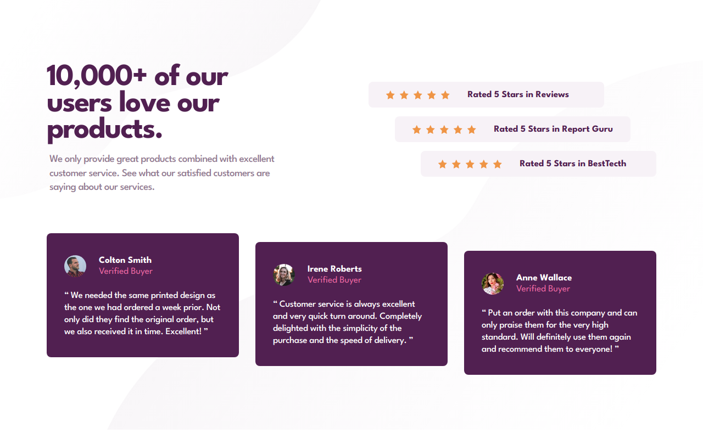

# Frontend Mentor - Social proof section solution

This is a solution to the [Social proof section challenge on Frontend Mentor](https://www.frontendmentor.io/challenges/social-proof-section-6e0qTv_bA). Frontend Mentor challenges help you improve your coding skills by building realistic projects. 

## Table of contents

- [Overview](#overview)
  - [The challenge](#the-challenge)
  - [Screenshot](#screenshot)
  - [Links](#links)
- [My process](#my-process)
  - [Built with](#built-with)
  - [What I learned](#what-i-learned)
  - [Continued development](#continued-development)
  - [Useful resources](#useful-resources)
- [Author](#author)

## Overview

### The challenge

Users should be able to:

- View the optimal layout for the section depending on their device's screen size

### Screenshot

### Links

- Solution URL: [https://www.frontendmentor.io/solutions/social-proof-section-using-react-aGRBTIEg02](https://www.frontendmentor.io/solutions/social-proof-section-using-react-aGRBTIEg02)
- Live Site URL: [https://social-proof-section-eta-flax.vercel.app/](https://social-proof-section-eta-flax.vercel.app/)

## My process

### Built with

- Semantic HTML5 markup
- SCSS
- Flexbox
- [React](https://reactjs.org/) - JS library

### What I learned

Practicing React and using the picture tag

### Continued development

I need to improve on looking at the details in the design before pushing

### Useful resources

- [A Guide to the Responsive IMages Syntax in HTML](https://css-tricks.com/a-guide-to-the-responsive-images-syntax-in-html/#using-picture) - I always come back to this website to review the picture tag. 

## Author

- Frontend Mentor - [@miguelzaga](https://www.frontendmentor.io/profile/miguelzaga)

